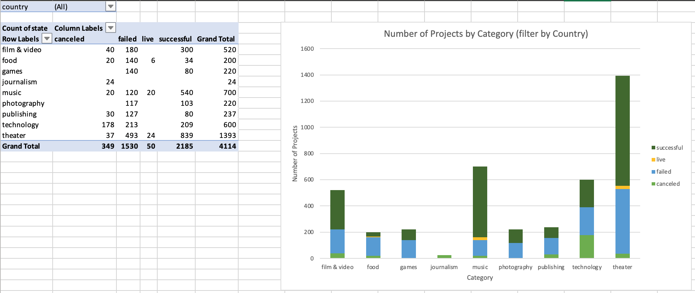
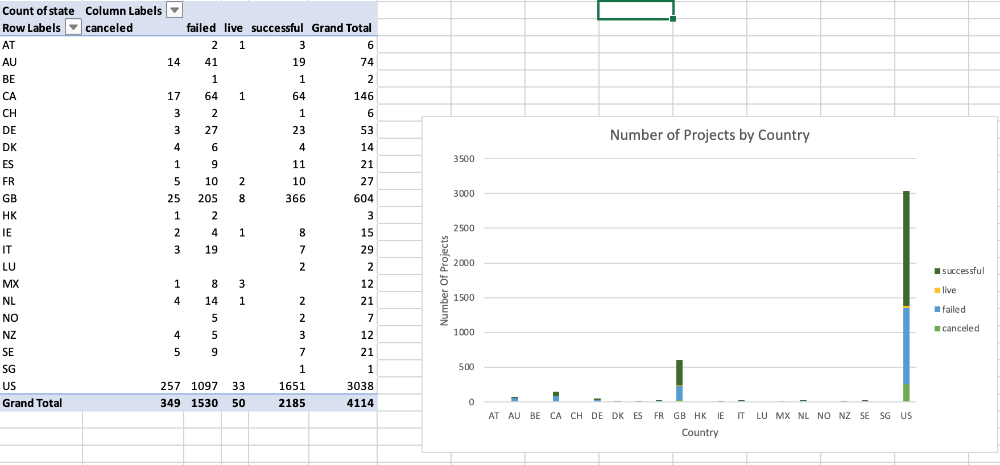
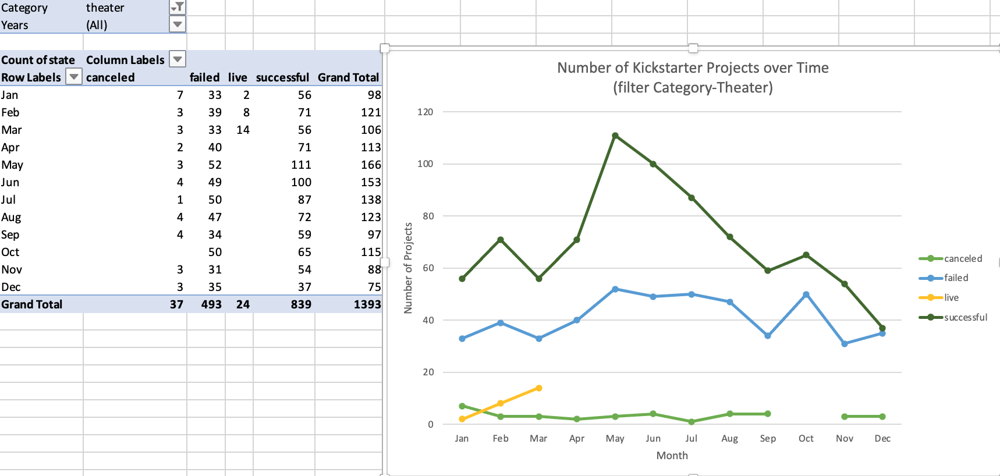
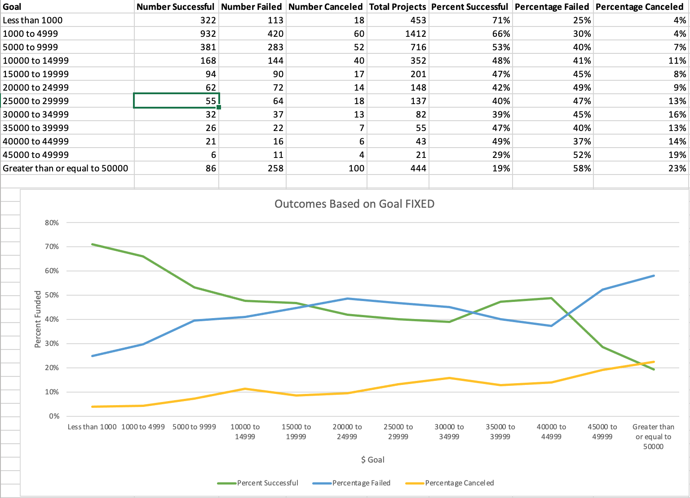
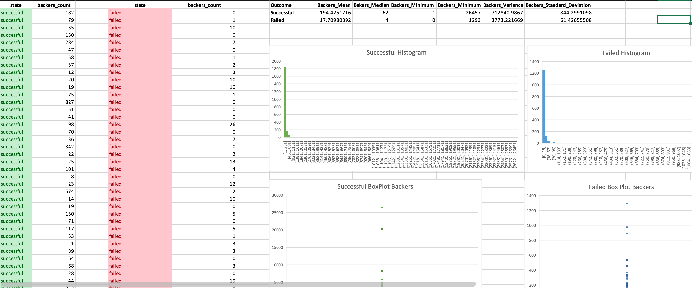

# Kickstart_My_Chart

## Background
Over $2 billion has been raised using the massively successful crowdfunding service, Kickstarter, but not every project has found success. Of the more than 300,000 projects launched on Kickstarter, only a third have made it through the funding process with a positive outcome.

Getting funded on Kickstarter requires meeting or exceeding the project's initial goal, so many organizations spend months looking through past projects in an attempt to discover some trick for finding success. Organize and analyze a database of 4,000 past projects in order to uncover any hidden trends.

## Technologies Used
- Excel

## Objective
- Use conditional formatting to fill each cell in the state column with a different color, depending on whether the associated campaign was successful, failed, or canceled, or is currently live.
    - Create a new column O called Percent Funded that uses a formula to uncover how much money a campaign made to reach its initial goal.

- Use conditional formatting to fill each cell in the Percent Funded column using a three-color scale. The scale should start at 0 and be a dark shade of red, transitioning to green at 100, and blue at 200.
    - Create a new column P called Average Donation that uses a formula to uncover how much each backer for the project paid on average.
    - Create two new columns, one called Category at Q and another called Sub-Category at R, which use formulas to split the Category and Sub-Category column into two parts.

    

    - Create a new sheet with a pivot table that will analyze your initial worksheet to count how many campaigns were successful, failed, canceled, or are currently live per category.
    - Create a stacked column pivot chart that can be filtered by country based on the table you have created.

    
    - Create a new sheet with a pivot table that will analyze your initial sheet to count how many campaigns were successful, failed, or canceled, or are currently live per sub-category.
    - Create a stacked column pivot chart that can be filtered by country and parent-category based on the table you have created.

- The dates stored within the deadline and launched_at columns use Unix timestamps. Fortunately for us, there is a formula that can be used to convert these timestamps to a normal date.
    - Create a new column named Date Created Conversion that will use this formula to convert the data contained within launched_at into Excel's date format.
    - Create a new column named Date Ended Conversion that will use this formula to convert the data contained within deadline into Excel's date format.

    

    - Create a new sheet with a pivot table with a column of state, rows of Date Created Conversion, values based on the count of state, and filters based on parent category and Years.
    - Now create a pivot chart line graph that visualizes this new table.

- Bonus
    - Using the COUNTIFS() formula, count how many successful, failed, and canceled projects were created with goals within the ranges listed above. Populate the Number Successful, Number Failed, and Number Canceled columns with this data.
    - Add up each of the values in the Number Successful, Number Failed, and Number Canceled columns to populate the Total Projects column. Then, using a mathematical formula, find the percentage of projects that were successful, failed, or canceled per goal range.
    - Create a line chart that graphs the relationship between a goal's amount and its chances at success, failure, or cancellation.

    

- Bonus: Statistical Analysis
- If one were to describe a successful crowdfunding campaign, most people would use the number of campaign backers as a metric of success. One of the most efficient ways that data scientists characterize a quantitative metric, such as the number of campaign backers, is by creating a summary statistics table.
    - Create a new worksheet in your workbook, and create a column each for the number of backers of successful campaigns and unsuccessful campaigns.
    - Use Excel to evaluate the following for successful campaigns, and then for unsuccessful campaigns:
        - The mean number of backers.
        - The median number of backers.
        - The minimum number of backers.
        - The maximum number of backers.
        - The variance of the number of backers.
        - The standard deviation of the number of backers.
    - Use your data to determine whether the mean or the median summarizes the data more meaningfully.
    - Use your data to determine if there is more variability with successful or unsuccessful campaigns. Does this make sense? Why or why not?

    

## Conclusions
The analysis concludes:
- Theater is the most successful category (by count)
    - There were almost 1400 theater campaigns with 839 being successful. This category also held the most failed campaigns, highlighting the enormity of this type of campaign overall. Dissecting the theater category even further, the plays sub-category is much more successful than the other sub-categories of musicals and spaces.
- The United States has the most Kickstarter campaigns (by count)
    - Country influences success as shown in every category of this data set. The United States reigns supreme in terms of the overall number of Kickstarter campaigns but more importantly, the number of successful Kickstarter campaigns.
- May is the most successful month (by count).
    - Lasty, month plays a role in a Kickstarter campaign’s success as shown with the overwhelming success in May. This trend of success in May is also reflective in the highly successful theater category.

### Contact:
Alex Arnold: alexnarnold630@gmail.com  